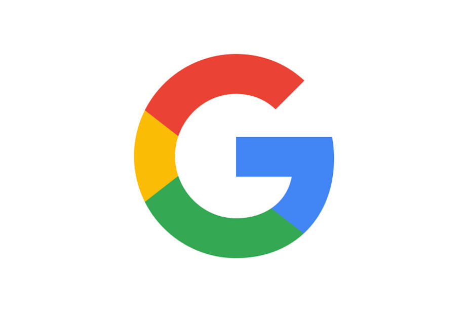

# Évaluation individuelle

## Programmation - Coaching

```
Nom : WANG	
Prénom : CHENGCHENG
URL de votre compte Github : https://github.com/wuyunweitian
```

## Déroulé et fonctionnement. 

L'évaluation est à faire sur [Typora](https://typora.io/). Les réponses sont à écrire dans les blocks de code. 
Pour la partie Ruby, testez votre code sur [repl.it](https://repl.it/) et copiez le dans les blocks de code prévu à cet effet. 
Une fois fini, pushez votre feuille sur Github, dans un nouveau repository que vous appelerez "evaluation-inseec".
L'évaluation est individuelle et durera 1h30. Elle intègre des notions d'HTML, CSS, Ruby et computer science. 


## Quelques mises en garde.

Je connais très bien ce merveilleux site qu'est Wikipédia. Je vous saurais gré de ne pas me remplir certaines questions avec les définitions de Wikipédia. Accessoirement, je sais aussi faire une recherche Google. Si j'ai un doute, je n'hésiterais pas rechercher "Qu'est-ce qu'une API" et comparer les définitions en tête de recherche avec les votre. Si je trouve une similarité trop grande et que je doute de votre bonne foi, je n'hésiterais pas à mettre 0 à la question. 
Pareil pour la copie sur les voisins. Si c'est trop gros et que j'ai un doute trop prononcé... 🔫


------

### 1. Avec vos mots, expliquez l'interaction client-serveur

```t
C'est l'interaction entre client et serveur. Par exemple, quand je utilise mon ordinatuer pour parcourir une page du web, mon ordinateur est une client et l'ordinateur qui gère la page di Web est le serveur. Les deux sont connectés via un navigateur.
```


 ### 2. HTML est un langage côté... 

```
Web
```


### 3. Donnez-moi la structure de base d'une feuille HTML

```html
<!DOCTYPE html>
<html>
    <head>
        <meta charset="utf-8">
        <link rel="stylesheet" href="style.css"
        <title>it is the tile</title>
    </head>
    <body>
    </body>
</html>
```


### 4. Changez la couleur du texte "J'adore la programmation" en rose en utilisant du CSS.

```html
<div>
   <p class="texte" >J'adore la programmation</p>
</div>
```

```css
.texte{
    color: rose;
}

```


### 5. Qu'est-ce que Bootstrap ?

```
Bootstrap est une front-end open source.Il concerne des codes HTML et CSS, des formulaires, boutons, outils de navigation et autres éléments interactifs, ainsi que des extensions JavaScript en option pour faciliter le développement de pages du Web dynamiques et d'applications du Web.
```


### 6. Reprenez votre code de la question 3 et ajoutez Bootstrap à votre feuille HTML, au bon endroit.

```html
<!DOCTYPE html>
<html>
     <head>
        <!-- Required meta tags -->
        <meta charset="utf-8">
        <meta name="viewport" content="width=device-width, initial-scale=1, shrink-to-fit=no">

        <!-- Bootstrap CSS -->
        <link rel="stylesheet" href="https://stackpath.bootstrapcdn.com/bootstrap/4.1.3/css/bootstrap.min.css" integrity="sha384-MCw98/SFnGE8fJT3GXwEOngsV7Zt27NXFoaoApmYm81iuXoPkFOJwJ8ERdknLPMO" crossorigin="anonymous">
        <link rel="stylesheet" href="style.css">
        <title>it is the tile</title>
    </head>
    <body>
    </body>
</html>

```


### 7. Mettez ces trois divs sur le même plan horizontal avec trois colonnes de même taille.

```html
<div class="row">
    <div class="col-sm-4">
    Google
   </div>

   <div class="col-sm-4">
    Microsoft
   </div>
    
  <div class="col-sm-4">
    Apple
  </div>
</div>
```


### 8. Avec le même code, changez le texte par le logo de la marque en question

```html
<div class="row">
    <div class="col-sm-4">
    
   </div>

   <div class="col-sm-4">
       
   </div>
    
  <div class="col-sm-4">
      
  </div>
</div>
```

 

### 9. Toujours sur le même bout de code, rendez les logos cliquables. Quand on clique sur le logo, on doit arriver sur le site officiel de la marque.

```html
<div>
    Google
</div>

<div>
    Microsoft
</div>

<div>
    Apple
</div>
```


### 10. Parlons Ruby. Ruby est un langage côté...

```
open-source dynamique
```


### 11. Listez-moi tous les types de données que vous connaissez.

```
float, intergerm，string, array, boolean
```


### 12. Assignez à des variables votre prénom, nom et le lien de votre compte Github puis affichez chacune des variables. En 6 lignes.

```ruby

```


### 13. Assignez 674 et 311 à des variables `a` et `b` et stockez le résultat `a` modulo `b` dans une variable `c` et affichez la. 

```ruby

# Le résultat attendu est 52. 
```


### 14. Qu'est-ce qu'une gem ? 

```texte

```


### 15. Qu'est-ce qu'une API et qu'est-ce qui nous permet de nous y connecter ?

```

```


### 14. On va créer un script pour dire bonjour ou bonsoir, en fonction de l'heure de la journée. Votre script doit demander à l'utilisateur de rentrer son prénom. Si `hour` est inférieur à 12, lui dire `Bonjour Anthony` sinon `Bonsoir Anthony` (évidemment, le prénom doit être celui renseigné par l'utilisateur).

```Ruby
# <- Demander le prénom de l'utilisateur

hour = 15

# Si hour est inférieur à 12
	# j'écris mon code permettant de dire Bonjour prénom

# sinon
	# j'écris mon code permettant de dire Bonsoir prénom

```


### 15. Itérer sur l'array contenant des noms de twitos un peu famous et follow chacun d'eux grâce à une méthode trouvée dans la [doc de la gem twitter](https://github.com/sferik/twitter). Pas besoin de lancer le code et de faire la partie authentification. Juste le bloc d'itération suffira. 

```ruby
handles = ["@richardbranson", "@jeffweiner", "@LinkedInQueen", "@ericschmidt", "@elonmusk", "@petecashmore", "@SteveForbesCEO", "@mtbarra"]


```


### 16. Félicitations, vous êtes arrivé·e à la fin, pushez cette feuille sur votre Github dans un repo appelé `evaluation-inseec`. N'oubliez pas de remplir le premier block avec votre identité tout en haut ! 


